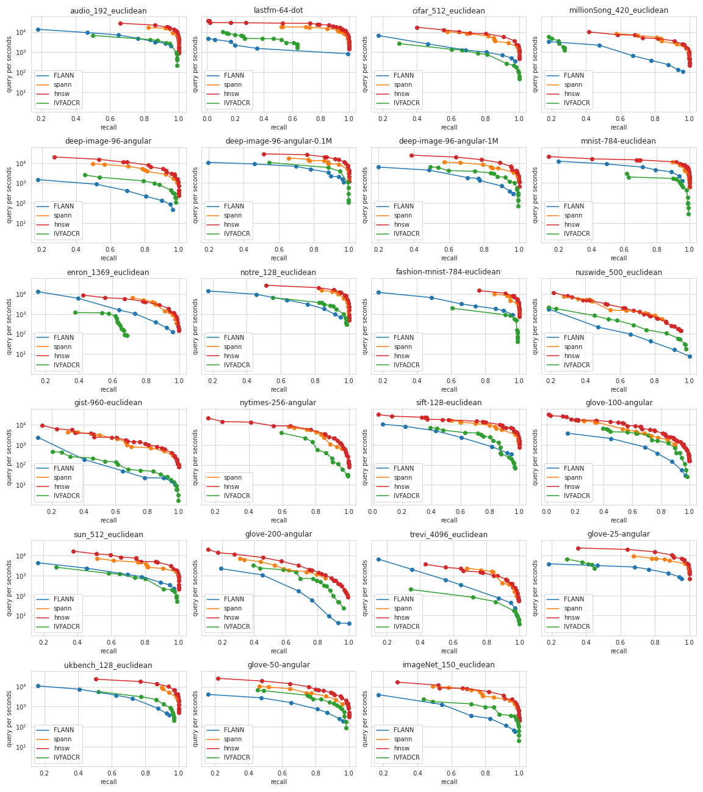

# Approximate Nearest Neighbor Search in High-dimensional Spaces

Approximate nearest neighbor (ANN) search has made an incredible improvement
in recent years due to the growing demands in the information age. Approaches
based on different design methodologies are proposed to solve the problems. How-
ever, the complexity of realistic datasets poses great challenges to ANN algorithms.
Thus, in this project, we conducted a comprehensive analysis of representative
algorithms on diverse datasets to study the pros and cons of each algorithm accord-
ing to a complete set of evaluation metrics. Furthermore, considering the realistic
needs to accomplish the best performance of each algorithm, we perform sensitivity
analysis on the prominent parameters.

# Data

| **Dataset**   | **Dimension** | **Train size** | **Test size** | **Distance** | **Brute force time (ms)** |
| ------------- | ------------- | -------------- | ------------- | ------------ | ------------------------- |
| Audio         | 192           | 50,000         | 10,000        | Euclidean    | 0.002331                  |
| Cifar         | 512           | 60,000         | 10,000        | Euclidean    | 0.002590                  |
| DEEP1B        | 96            | 9,990,000      | 10,000        | Angular      | 0.229771                  |
| Enron         | 1369          | 85,187         | 10,000        | Euclidean    | 0.010190                  |
| Fashion-MNIST | 784           | 60,000         | 10,000        | Euclidean    | 0.002750                  |
| GIST          | 960           | 1,000,000      | 1,000         | Euclidean    | 0.050297                  |
| GloVe         | 25            | 1,183,514      | 10,000        | Angular      | 0.015654                  |
| GloVe         | 50            | 1,183,514      | 10,000        | Angular      | 0.016515                  |
| GloVe         | 100           | 1,183,514      | 10,000        | Angular      | 0.018424                  |
| GloVe         | 200           | 1,183,514      | 10,000        | Angular      | 0.023513                  |
| ImageNet      | 150           | 2,400,000      | 10,000        | Euclidean    | 0.063895                  |
| Last.fm       | 65            | 292,385        | 50,000        | Angular      | 0.003701                  |
| MNIST         | 784           | 60,000         | 10,000        | Euclidean    | 0.002524                  |
| Msong         | 420           | 1,000,000      | 10,000        | Euclidean    | 0.058323                  |
| Notre         | 128           | 300,000        | 10,000        | Euclidean    | 0.008549                  |
| Nusw          | 500           | 2,700,000      | 10,000        | Euclidean    | 0.014243                  |
| NYTimes       | 256           | 290,000        | 10,000        | Angular      | 0.008646                  |
| SIFT          | 128           | 1,000,000      | 10,000        | Euclidean    | 0.017034                  |
| Sun397        | 512           | 80,000         | 10,000        | Euclidean    | 0.004000                  |
| Trevi         | 4096          | 100,000        | 10,000        | Euclidean    | 0.034791                  |
| UKbench       | 128           | 1,000,000      | 10,000        | Euclidean    | 0.026515                  |

# Results

